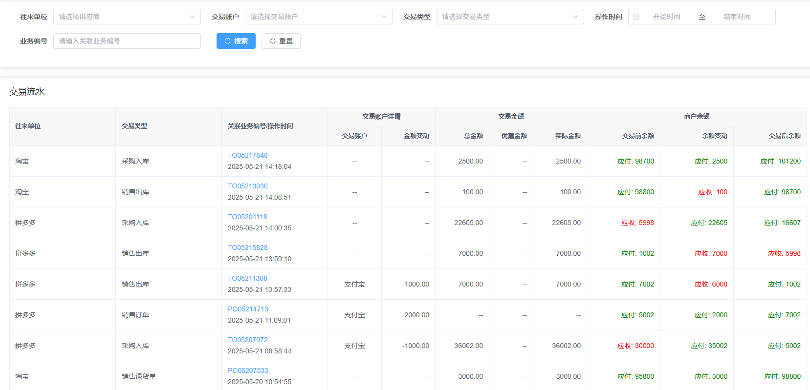
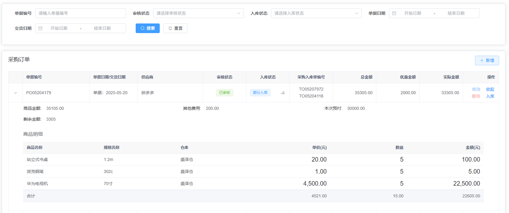

## 平台简介

> 本项目基于ruoyi-vue-fast实现

> 项目代码、文档 均开源免费可商用 遵循开源协议在项目中保留开源协议文件即可 
活到老写到老 为兴趣而开源 为学习而开源 为让大家真正可以学到技术而开源

若依erp是一套基于若依的erp管理系统。毫无保留给个人及企业免费使用。
* 前端采用Vue、Element UI。
* 后端采用Spring Boot、Spring Security、Redis & Jwt。
* 权限认证使用Jwt，支持多终端认证系统。
* 支持加载动态权限菜单，多方式轻松权限控制。
* 高效率开发，使用代码生成器可以一键生成前后端代码。

## 前端项目地址
#### gitee
[https://gitee.com/zccbbg/ruoyi-erp-vue](https://gitee.com/zccbbg/ruoyi-erp-vue)

#### github
[https://github.com/zccbbg/ruoyi-erp-vue](https://github.com/zccbbg/ruoyi-erp-vue)

## 若依实战技术专栏
关注文末公众号回复：星球

## 在线体验

## 若依erp功能
1. 首页：库存预警与到期提醒、基础数据报表展示
2. 购货：包括购货订单、购货入库、购货退货
3. 销货：包括销货订单、销货入库、销货退货
4. 仓库
   入库：创建入库单后包括如下几个状态：暂存、审核完成
   出库：创建出库单后包括如下几个状态：暂存、审核完成
   移库：创建移库单后包括如下几个状态：暂存、审核完成
   盘库：创建盘库单后包括如下几个状态：暂存、审核完成
5. 资金：管理维护仓库基础数据 
6. 统计
   库存看板：查看当前物料库存数量，分仓库、商品等维度
7. 基础资料：
   客户/供应商：管理维护联系人基础数据
   物料：管理维护物料基础数据
8. 流水
   库存记录：查看当前物料库存操作记录
   交易流水：查看当前资金操作记录

## 更新记录
> 参考：[UpdateHistory.md](docs/UpdateHistory.md)

## 提交issue和PR
> 提交issue前请先阅读：[ISSUE_TEMPLATE.zh-CN.md](docs/ISSUE_TEMPLATE.zh-CN.md)
> 
> 提交PR前请先阅读：[PULL_REQUEST_TEMPLATE.zh-CN.md](docs/PULL_REQUEST_TEMPLATE.zh-CN.md)

## 本地运行
https://docs.ichengle.top/wms/open/run2.html
## 系统部署文档
https://docs.ichengle.top/wms/open/ops2.html

## 演示图

## 贡献代码

欢迎各路英雄豪杰 `PR` 代码 请提交到 `dev` 开发分支 统一测试发版

## 关于我们
开发团队成立于2017年，我们前端开发、后端架构，有一颗热爱开源的心，致力于打造企业级的通用产品设计UI体系让项目 或者更直观，更高效、更简单，未来将持续关注UI交互，持续推出高质量的交互产品。

## 加群/技术支持

|                  公众号                   |
|:--------------------------------------:|
|  |
扫公众号二维码，关注后回复：“加群”或“支持”